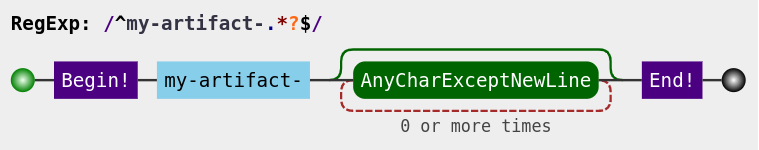

# Download-Artifact-RegExp

This downloads artifacts with RegExp from your build

See also [upload-artifact](https://github.com/actions/upload-artifact).

# Usage

See [action.yml](action.yml)

Basic (download to the current working directory):
```yaml
steps:
- uses: actions/checkout@v2

- uses: elonh/download-artifact-regexp@master
  with:
    pattern: ^my-artifact-.*$
    # my-artifact-
    # my-artifact-a
    # my-artifact-ab
    # ...
- run: cat my-artifact
```
[RegExp Visualize](https://jex.im/regulex/#!flags=&re=^my-artifact-.*%3F%24)



Download to a specific directory:
```yaml

steps:
- uses: actions/checkout@v2

- uses: elonh/download-artifact-regexp@master
  with:
    pattern: ^my-artifact$
    path: path/to/artifact
    
- run: cat path/to/artifact
```

> Note: If the `pattern` input parameter is not provided, all artifacts will be downloaded.

To differentiate between downloaded artifacts, a directory denoted by the artifacts name will be created for each individual artifact.

Example, if there are two artfiacts `Artifact-A` and `Artifact-B`, and the directory is `etc/usr/artifacts/`, the directory structure will look like this:
```
  etc/usr/artifacts/
      Artifact-A/
          ... contents of Artifact-A
      Artifact-B/
          ... contents of Artifact-B
```

Download all artifacts to a specific directory
```yaml
steps:
- uses: actions/checkout@v2

- uses: elonh/download-artifact-regexp@master
  with:
    path: path/to/artifacts
    
- run: cat path/to/artifacts
```

Download all artifacts to the current working directory
```yaml
steps:
- uses: actions/checkout@v2

- uses: elonh/download-artifact-regexp@master
```


# License

The scripts and documentation in this project are released under the [MIT License](LICENSE)
